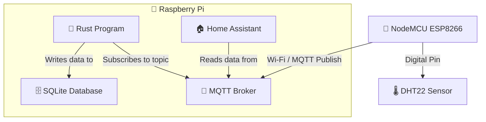

# weather-station
Weather station on NodeMCU using a DHT22 temperature sensor

```mermaid
flowchart TD
    ESP["🔌 NodeMCU ESP8266"] -->|Digital Pin| DHT["🌡️ DHT22 Sensor"]
    ESP -->|Wi-Fi / MQTT Publish| MQTT["📡 MQTT Broker"]

    subgraph "🍓 Raspberry Pi"
        direction TB
        MQTT
        Rust["🦀 Rust Program"]
        DB["🗄️ SQLite Database"]
        HA["🏠 Home Assistant"]
    end

    Rust -->|Subscribes to topic| MQTT
    Rust -->|Writes data to| DB
    HA -->|Reads data from| MQTT
```
